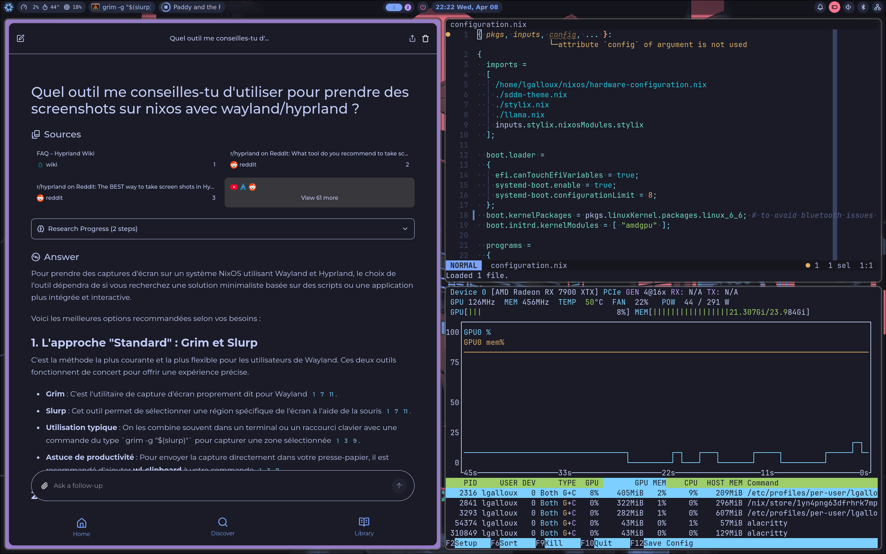
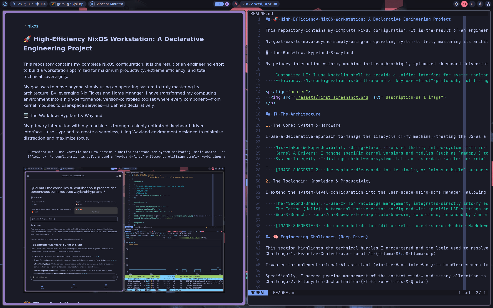

# 🚀 High-Efficiency NixOS Workstation

### _A Declarative Configuration Project_

This repository contains my complete NixOS configuration. The goal is to maintain a workstation where every component—from kernel modules to user-space services—is defined declaratively, ensuring a reproducible and version-controlled environment.

By leveraging **Nix Flakes** and **Home Manager**, I have transitioned from manual system management to a configuration-as-code approach, optimizing for both stability and workflow efficiency.

## The Workflow: Hyprland & Wayland

> **Philosophy:** _A keyboard-centric environment optimized for focus._

- **System Interface** | `Noctalia-shell`
  A unified interface for system monitoring, media control, and notifications, integrated with underlying system services.
- **Input Method** | `Keyboard-First`
  A workflow designed to minimize mouse usage through custom keybindings and submaps.

  

# 🏗️ The Architecture

## 1. The Core: System & Hardware

> **Philosophy:** _Managing the OS as a reproducible unit._

- **Reproducibility** | `Nix Flakes`
  Locked system state to ensure predictable updates and easy environment reconstruction.
- **Hardware Management** | `Kernel & udev`
  Control over specific kernel modules (e.g., `amdgpu`) and custom `udev` rules for device handling.
- **Data Integrity** | `Btrfs + Snapper`
  Separation of system state and user data using Btrfs subvolumes and Snapper snapshots.

  

## 2. The Toolchain: Knowledge & Productivity

> **Philosophy:** _A terminal-native ecosystem for streamlined workflows._

- **Knowledge Management** | `zk (Markdown)`
  A structured, Markdown-based note-taking system integrated into the editor.
- **Editor Configuration** | `Helix`
  A terminal-native editor configured with specific LSP settings and system-wide theming via `Stylix`.
- **Web Stack** | `Zen + Searxng`
  A privacy-focused browsing setup using `Zen Browser`, `Vimium-C` for navigation, and `Searxng` for search.

  

# 🧠 Engineering Challenges

This section outlines the technical challenges encountered and the logic used to resolve them.

---

### Case Study 1: Local AI Inference Control

**Objective:** Implement a local AI assistant with controlled resource usage and data privacy.

- **The Problem:** Using `Ollama` provided a high-level API that lacked granular control over the inference engine.
- **The Constraint:** I needed to manage the **context window** and **memory allocation** directly to optimize performance.
- **The Solution:** Migrated the stack to `llama-cpp-rocm` and `llama-swap`. This allowed for fine-tuning inference parameters via a custom `systemd` service, ensuring efficient hardware utilization.

---

### Case Study 2: Filesystem Orchestration

**Objective:** Design a storage architecture that separates system state from user data.

- **The Problem:** A standard installation did not provide sufficient isolation between volatile system files and persistent user data.
- **The Constraint:** Required a multi-subvolume Btrfs setup with specific disk quotas and integrated mount points during the NixOS boot process.
- **The Solution:** Implemented a subvolume hierarchy where `/home` is managed via **Snapper** snapshots, effectively decoupling user data from NixOS atomic rollbacks.

# 📊 Summary of Technologies

| Category              | Tools                          | Purpose                                     |
| :-------------------- | :----------------------------- | :------------------------------------------ |
| **OS / Kernel**       | NixOS, Linux Kernel            | Reproducibility & Full Control              |
| **Config Management** | Nix Flakes, Home Manager       | Declarative Environment                    |
| **Shell**             | Zsh, Zoxide, Direnv            | Context-aware environment                   |
| **Editor**            | Helix                          | Modal editing & Terminal-native workflow    |
| **Web**               | Zen Browser, Vimium-C, Searxng | Privacy & Keyboard-driven browsing          |
| **AI & Inference**    | llama-cpp-rocm, Podman         | Local, private inference                    |
| **Storage**           | Btrfs, Snapper, LUKS           | Data integrity & Atomic snapshots           |

